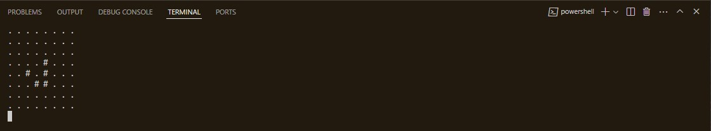

# Conway's Game of Life

### RULES -
- Any live cell with fewer than two live neighbours dies, as if by underpopulation.
- Any live cell with two or three live neighbours lives on to the next generation.
- Any live cell with more than three live neighbours dies, as if by overpopulation.
- Any dead cell with exactly three live neighbours becomes a live cell, as if by reproduction.
---
### Running the Game!
- Windows 
    ``` powershell
    > py .\gol.py <TPS> <GENERATIONS>
    ```
- MacOS and GNU/Linux   
    ``` console
    $ ./gol.py <TPS> <GENERATIONS>
    ```
> **TPS** and **GENERATIONS** are not mandatory arguments. 
---
### Example =>

